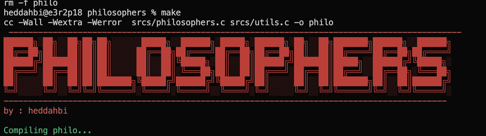

# 🍽️ Philosophers

## Overview

The **Philosophers** project is a simulation of the classic Dining Philosophers problem, which demonstrates synchronization issues and solutions in concurrent programming. In this project, you'll implement a system where philosophers (threads) alternate between thinking and eating while sharing resources (forks). The challenge is to ensure that the philosophers can eat without deadlocks or starvation. 🧠💭

## 🚀 Project Objectives

- Implement the Dining Philosophers problem using threads and mutexes.
- Ensure that philosophers can eat and think without causing deadlocks or resource contention.
- Understand and apply concepts of synchronization, concurrency, and thread management.

## 📸 Visual Overview

### Problem Setup



This diagram shows the initial setup with philosophers seated around a table and forks between them.

### Implementation

![Implementation]

This screenshot illustrates the implementation details, including thread creation, mutexes, and the state transitions of philosophers.

### Execution

![Execution]

Here’s how the simulation looks in action, with philosophers eating and thinking as per the implemented logic.

## 🛠️ Implementation Details

### Main Components

- **Philosophers:** Threads that alternate between thinking and eating.
- **Forks:** Shared resources represented by mutexes to prevent concurrent access.
- **Mutexes:** Used to synchronize access to forks and manage resource contention.

### Key Functions

- `philosopher_routine`: The main routine for each philosopher thread, handling the thinking and eating logic.
- `take_forks`: Function to acquire the necessary forks for eating.
- `release_forks`: Function to release the forks after eating.

## 📋 Project Structure

```plaintext
.
├── LICENSE
├── Makefile
├── README.md
├── image
│   └── image.png
└── srcs
    ├── philosophers.c
    ├── philosophers.h
    └── utils.c

3 directories, 7 files

```

## 🔧 Compilation

To compile the project, use the provided `Makefile`:

```bash
make
```

This will generate an executable called `philo`.

## 📈 Usage

To run the simulation, execute the `philosophers` binary with the number of philosophers and the time parameters:

```bash
./philosophers <number_of_philosophers> <time_to_die> <time_to_eat> <time_to_sleep>
```

Example:

```bash
./philosophers 5 800 200 200
```

## 🧪 Testing

Test your implementation by:

- Running simulations with different numbers of philosophers.
- Checking for deadlocks and ensuring all philosophers get a chance to eat.
- Observing the behavior under different timing configurations to validate robustness.

## 📚 Learning Objectives

By completing this project, you will:
- Gain insights into synchronization and concurrency issues.
- Learn to manage shared resources using mutexes and threads.
- Understand and apply solutions to avoid deadlocks and ensure fair resource allocation.

## 🌟 Bonus Objectives

For additional practice and enhancement, consider the following:

- **Optimization:** Improve the efficiency of the solution, such as using different scheduling or locking strategies.
- **Visualization:** Create graphical or textual representations of the simulation to better understand the dynamics.

## 📜 License

This project is open-source and available under the [MIT License](LICENSE). Feel free to fork, modify, and contribute!

